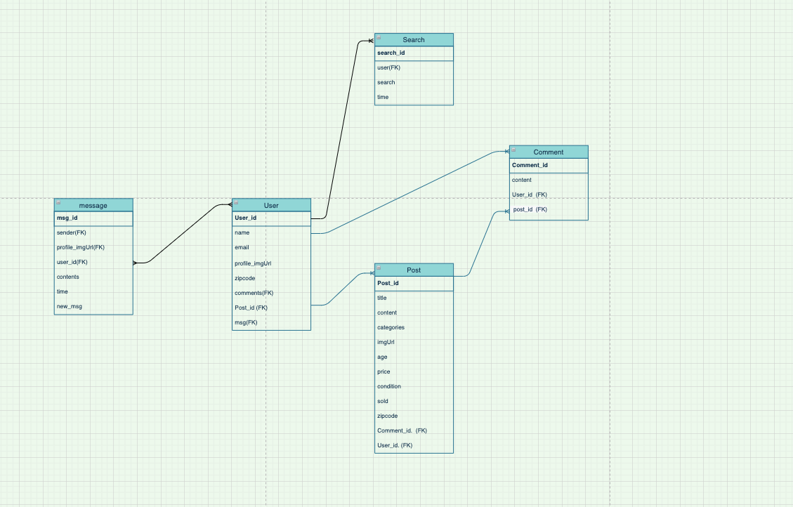

# project4 - Kids 2 Kids

## Purpose
This is an app to allow users to sell or buy children's used items

## Technologies Used
- django
- Postgresql
- python
- dotenv


Database ERD


## Models 
- Post
- Comment
- User
- Message
- Search (stretch goal)

## User Stories
- User can see the posts without logging in/ User needs to log in for other activities
- User can posts/edit/delete posts with images to sell their items
- User can wirte/edit/delete comments on posts
- User can search the item with title, cateogry, age, and zipcode
- User can message to other users to exchange their personal informations
- When there's new message, user will receive the alrert next to her message link

## Installation 
1. Fork and clone the repository.
    - if you are starting your project on your own, type "django-admin startproject kids2kids" in your terminal 
3. Type "python3 manage.py runserver" in your terminal 
4. check local host number in your terminal, and Open it.
    - if it says localhost:8000, open [http://localhost:8000](http://localhost:8000) to view it in the browser.
5. "pip3 install psychopg2" in your terminal
6. Create database in postgres. Type "createdb kids2kids " in your terminal 


## Rundown Progress 

Day One 
1. setup posts model 
2. finish CRUD for posts  
    - Get route for posts 
    - get route for specific post
    - put route for posts
    - delete route for posts 
3. User model 
    - user authentication

Day Two
1. Post 
    - image uploading 
3. setup the comments model 
4. comments CRUD
    - comment get 
    - commnet post 
    - comment put 
    - comment delete <br>
    
    Blockers: <br>
        - grabbing post id when create the comments <br>
    Solutions: <br>
        - grabbing the incident of the data, not just the id <br>
        - self.object.post_id = Post.objects.get(pk= self.kwargs['pk']) 


Day Three

1. Search Filter
    - Set up search model 
    - Make search bar 
    - Filter function <br>

    Blockers : <br>
        - pip install filter to python 2.7<br>
    Solutions: <br>
        - pip3 install --upgrade --force pip<br>
        - python3 -m pip install --upgrade --force pip<br>
        - pip -V<br>

Day Four

1. setup the message model
2. message CRUD 
    - msg create
        - msg form 
    - msg get (using filter) 
        - filter by sender 
        - recently received msg 
    - msg delete route


Day Five
1. Heroku deployment

Day six
1. CSS Styling 
2. Bug fix 


## Stretch goals : 

    1. More precise search based on user's zipcode. 
        - when user make account, user search her locations and save them, then the data will automatically be rendered accroding to saved user's location
        
    2. showing previous related search 
        - create route to search model in filter/ search bar
        - get route to search model to grab the realted posts from Post model to display 

## Major hurdles I had to overcome 

1. New message alerts
    - in order to indicate the new message in base.html, I had to create new python file. 

context_processors.py
```python
def add_variable_to_context(request):
    print(str(request.user.id))

    if request.user.id:
        message = Message.objects.filter(receiver=str(request.user.id), new=True) 
        print(message)
        if message:
            return {"test": "You have new message!"}
        else:
            return{"test":"no new message"}
    else:
        return {"test":""}
```

{{test}} renders the message. This message and few other menues are only showing to user who is logged in 

templates/base.html
```html
 <header>
        
        <p>
        <span><a href="">Hello, {{ user.username }}!</a></span>
        <span> | </span>
        <span><a href="">Logout</a></span>
        <span> | </span>
        <span><a href="">Market</a></span>
        <span> | </span>
        <span><a href=""> Sell</a></span>
        <span> | </span>
        <span><a href=""> Message </a></span>
        {{test}}
        </p>
       
         
        <p>
        <span><a href=""> Login </a></span>
        <span> | </span>
        <span><a href="">SignUp</a></span>
        <span> | </span>
        <span><a href="">Market</a></span>
        
        </p>
        
```
- in message model, there's field called new. 
The default value of new is True, and the user who opened the message box is the receiver of the message, the value will be changed to false, therefore there will be no mew message alert. 

``` python
class Message(models.Model):
    content = models.TextField(max_length=500)
    sender = models.ForeignKey(User(), on_delete=models.CASCADE,related_name="sender")
    receiver = models.ForeignKey(User(), on_delete=models.CASCADE, related_name="receiver")
    message_file = models.FileField(upload_to='message/')
    timestamp = models.DateTimeField(auto_now_add=True)
    new = models.BooleanField(default = True)
    
    class Meta:
        ordering = ['timestamp']
    def __str__(self):
        return (self.content)
```

``` python
def inbox_detail_view(request, username, sender_id):
    # print(username)
    user = User.objects.get(pk=username)
    message = Message.objects.filter(Q(receiver=user.pk,sender= sender_id)| Q(receiver= sender_id, sender=user.pk)).order_by('timestamp') 
    receiver = sender_id
    receiver_name = User.objects.get(pk=sender_id)
    for msg in message:
        print(msg.receiver.id, username, msg.new)
        if str(msg.receiver.id) == username:
            print(msg.receiver.id, username)
            msg.new = False
            msg.save()
            print(msg.new)
        else:
            print('hello')

    # message = Message.objects.filter(receiver=user, sender=sender_id)
    return render(request, 'message/inbox_detail.html', {'messagess':message, 'user':user, 'receiver':receiver, 'receiver_name':receiver_name})
```

2. Message inbox rendering 
- in order to render the sender's user name only once with recent message, I used '.order_by('sender','-timestamp').distinct('sender')'

``` python
def inbox_view(request, username):
    print(username)
    user = User.objects.get(username=username)
    message = Message.objects.filter(receiver=user.pk).order_by('sender','-timestamp').distinct('sender')
    print(message)
    # messagess = message.distinct('receiver_id')
    return render(request, 'message/inbox.html', {'messagess':message, 'user':user })
```
